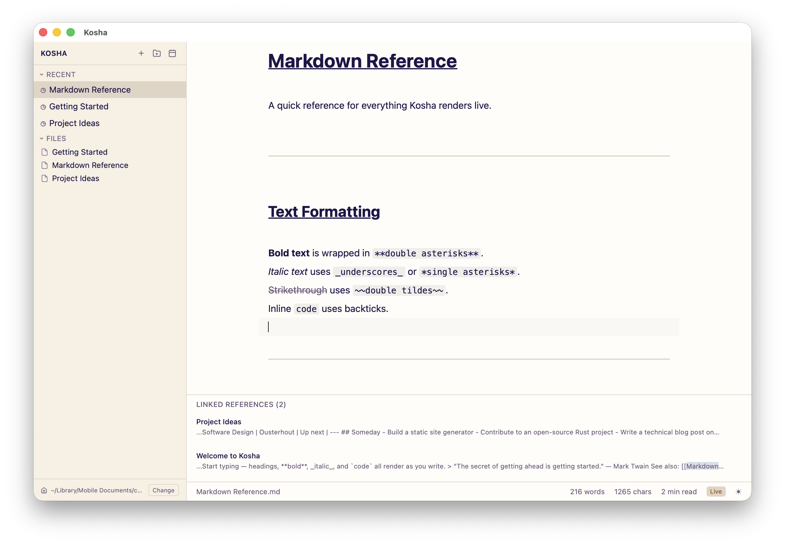
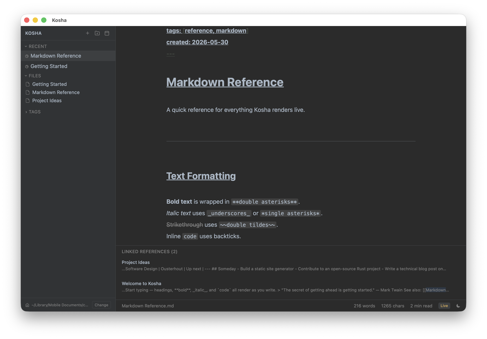

# Kosha

> **कोश** (Sanskrit: "treasury") — A minimal personal knowledge keeper for macOS.

Kosha is a native macOS app for writing and organizing Markdown notes with **live in-place rendering** — type `# Heading`, the `#` hides and your text renders as a styled heading. Move your cursor back in and the syntax reappears for editing. No mode switching, no preview pane.

| Light | Dark |
|---|---|
|  |  |

**[⬇ Download Kosha 0.3.0 for macOS (Apple Silicon)](https://github.com/ResByte/kosha/releases/download/0.3.0/Kosha_0.3.0_aarch64.dmg)**

---

## Features

- **Live Markdown rendering** — headings, bold, italic, strikethrough, inline code, blockquotes, links, checkboxes, horizontal rules, wiki-links, and YAML frontmatter all render in-place
- **Plain `.md` files** — no proprietary format, no lock-in; your notes work in any editor
- **Full-text search** — SQLite FTS5 index with porter stemming; `Cmd+K` quick-switcher, `Cmd+Shift+F` full-text search
- **Wiki-links** — `[[Note Name]]` navigates between notes; backlinks panel shows what links to the current note
- **Tags** — YAML frontmatter tags with sidebar filtering
- **Dark / light theme** — toggle with `Cmd+Shift+T`, persists across restarts
- **Auto-save** — debounced 2-second write to disk; `Cmd+S` for manual save
- **iCloud sync ready** — production data lives in `~/Library/Mobile Documents/com~kosha/`

---

## Tech Stack

| Layer | Technology |
|---|---|
| Desktop shell | [Tauri v2](https://tauri.app) (Rust backend, ~5 MB bundle) |
| Frontend | [Svelte 5](https://svelte.dev) + [SvelteKit](https://kit.svelte.dev) |
| Language | TypeScript (strict mode) |
| Editor | [CodeMirror 6](https://codemirror.net) |
| Styling | [TailwindCSS v4](https://tailwindcss.com) |
| Math | [KaTeX](https://katex.org) |
| Search | SQLite FTS5 via [`rusqlite`](https://github.com/rusqlite/rusqlite) |
| Package manager | pnpm |

---

## Getting Started

### Prerequisites

```bash
# Rust
curl --proto '=https' --tlsv1.2 -sSf https://sh.rustup.rs | sh
source "$HOME/.cargo/env"

# Node (via nvm or direct)
node --version   # >= 18

# pnpm
curl -fsSL https://get.pnpm.io/install.sh | sh -
```

### Install & run

```bash
git clone <repo-url> kosha
cd kosha
pnpm install

# Development (hot reload)
pnpm tauri dev

# Production build
pnpm tauri build
```

> **First run:** the app creates `~/.kosha-data/` and indexes any `.md` files it finds there. A sample "Getting Started" note is included.

---

## Keyboard Shortcuts

| Action | Shortcut |
|---|---|
| Quick switcher | `Cmd+K` |
| Full-text search | `Cmd+Shift+F` |
| New note | `Cmd+N` |
| Toggle sidebar | `Cmd+B` |
| Find in current note | `Cmd+F` |
| Toggle source / live mode | `Cmd+/` |
| Toggle dark / light theme | `Cmd+Shift+T` |
| Manual save | `Cmd+S` |
| Go back / forward | `Cmd+[` / `Cmd+]` |

---

## Project Structure

```
kosha/
├── src/
│   ├── routes/
│   │   ├── +layout.svelte       # Shell layout, event listeners, theme persistence
│   │   └── +page.svelte         # Editor page: load/save, shortcuts, templates
│   └── lib/
│       ├── components/
│       │   ├── Sidebar.svelte   # File tree, favorites, recent, tags, trash
│       │   ├── SearchModal.svelte
│       │   ├── StatusBar.svelte
│       │   ├── TemplateModal.svelte
│       │   └── ConflictModal.svelte
│       ├── editor/
│       │   ├── setup.ts         # CM6 editor factory, theme/decoration compartments
│       │   ├── decorations.ts   # All live-preview decorations (block + inline)
│       │   └── floating-toolbar.ts
│       ├── stores/
│       │   └── app.svelte.ts    # Global state (Svelte 5 $state runes)
│       ├── frontmatter.ts       # YAML frontmatter parse/serialize
│       └── tauri.ts             # Typed invoke() wrappers
├── src-tauri/
│   └── src/
│       ├── lib.rs               # App entry, command registration, watcher startup
│       ├── commands.rs          # File I/O, trash, settings, data dir management
│       ├── search.rs            # SQLite FTS5 index (porter stemmer)
│       ├── watcher.rs           # notify v7 file watcher
│       └── import.rs            # Notion ZIP import
└── screenshots/
```

---

## Data Layout

| Path | Purpose |
|---|---|
| `~/.kosha/config.json` | Chosen notes directory (never synced) |
| `~/.kosha/settings.json` | UI settings (theme, etc.) |
| `~/.kosha/search.db` | SQLite FTS5 search index |
| `~/kosha-data/` | Default notes directory (user-configurable) |
| `<data-dir>/.trash/` | Soft-deleted notes (auto-purged after 30 days) |

### Note format

```markdown
---
tags: [python, pandas]
created: 2026-05-30
---

# Handling Missing Values

Use `df.dropna()` or `df.fillna()` ...
```

---

## Scope

Kosha is intentionally minimal. It will **not** include:

- Split-pane editor, block editor, or rich-text WYSIWYG
- Databases, Kanban boards, or task management
- AI, semantic search, or embeddings
- Real-time collaboration or self-hosted sync
- Plugins or a scripting API
- Windows, Linux, iOS, Android, or web

---

## License

MIT
